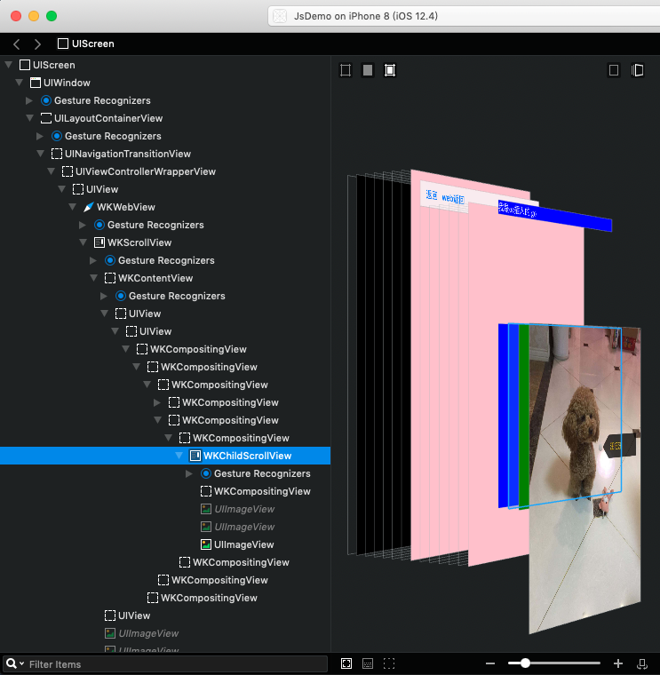

# jsbridge-demo

## hybrid

#### URL 拦截
- webview 能够执行js，监听url的跳转，加载，失败/成功，返回等 delegate。
- 通过约束 url，比如 schema，js 需要唤起OC的时候跳转指定的约束的 url，OC 拦截 url 判断是允许跳转还是自定义操作

```javascript
location.href = 'alert://哈哈哈哈'
```

```objective-c
- (void)webView:(WKWebView *)webView decidePolicyForNavigationAction:(WKNavigationAction *)navigationAction decisionHandler:(void (^)(WKNavigationActionPolicy))decisionHandler {
    NSString * urlStr = navigationAction.request.URL.absoluteString;
    NSLog(@"发送跳转请求：%@",urlStr);
    //自己定义的协议头
    NSString *htmlHeadString = @"alert://";
    NSString *decodedString=(__bridge_transfer NSString *)CFURLCreateStringByReplacingPercentEscapesUsingEncoding(NULL, (__bridge CFStringRef)[urlStr substringFromIndex: 8], CFSTR(""), CFStringConvertNSStringEncodingToEncoding(NSUTF8StringEncoding));
    if([urlStr hasPrefix:htmlHeadString]){
        UIAlertController *alertController = [UIAlertController alertControllerWithTitle:@"通过截取URL调用OC" message:decodedString preferredStyle:UIAlertControllerStyleAlert];
        [alertController addAction:([UIAlertAction actionWithTitle:@"哦哦" style:UIAlertActionStyleCancel handler:^(UIAlertAction * _Nonnull action) {}])];
        [self presentViewController:alertController animated:YES completion:nil];
        decisionHandler(WKNavigationActionPolicyCancel);
    }else{
        decisionHandler(WKNavigationActionPolicyAllow);
    }
}
```

### JavaScriptCore
- JSContext 可以创建js的执行上下文或者通过 KVC 的方式取到`UIWebview`的js上下文(注意WKWebview不能取到)
- 获取到上下文对象 JSContext 后，可以把 OC 的对象注入到 js，js 在上下文中可以取到这个注入的对象

```objective-c
//创建context
    self.context = [_webView valueForKeyPath:@"documentView.webView.mainFrame.javaScriptContext"]; // wkwebview 里没有这玩意
    //设置异常处理
    self.context.exceptionHandler = ^(JSContext *context, JSValue *exception) {
        [JSContext currentContext].exception = exception;
        NSLog(@"exception:%@",exception);
    };
    //将obj添加到context中
    self.context[@"OCObj"] = self;
```

- 被注入的OC对象需要定义 JSExport 协议，并实现，js 能够调用OC对象的定义在 JSExport 里的方法，注意OC的消息与js的方法结构不一样，需要用 JSExportAs 转换

```objective-c
//定义一个JSExport protocol
@protocol JSExportProtocol <JSExport>

//用宏转换下，将JS函数名字指定为add；
JSExportAs(add, - (NSInteger)add:(NSInteger)n1 with:(NSInteger)n2);
JSExportAs(addByCallback, - (void)add:(NSInteger)n1 with:(NSInteger)n2 callback:(JSValue *)cb);
JSExportAs(openWKWebView, - (void)openWKWebView:(id)param);
JSExportAs(callThread, - (void)callThread:(id)param);
JSExportAs(showHtml, - (void)showHtml:(NSString *)str);

@end
```

```javascript
	  function callOCGetReturn() {
            // 调用 OC 方法，OCObj 是注入的全局变量
            const sum = OCObj.add(Math.random() * 10, 6);
            const el = document.createElement('h1');
            el.innerText = `同步的结果: ${sum}`;
            document.body.appendChild(el);
        }

        function callOCWithBlock() {
            OCObj.addByCallback(Math.random() * 10, 6, function (sum) {
                const el = document.createElement('h1');
                el.innerText = `回调的结果: ${sum}`;
                document.body.appendChild(el);
            });
        }
```

- JSContext 可以执行一段js，可以带上参数和获取返回值，并且参数可以传 block，这就可以使 js 里异步执行传递的 block

```objective-c
	//  调用js的时候传参为一个数组，相当于 fn.apply(null, [xx])
    [_context[@"changeColor"] callWithArguments:@[@"green", @"yellow", ^(JSValue *value) {
        UIAlertController *alertController = [UIAlertController alertControllerWithTitle:@"oc call js callback" message:value.toString preferredStyle:UIAlertControllerStyleAlert];
        [alertController addAction:([UIAlertAction actionWithTitle:@"哦" style:UIAlertActionStyleDefault handler:^(UIAlertAction * _Nonnull action) {
        }])];
        [self presentViewController:alertController animated:YES completion:nil];
    }]];
```

- JSValue：表示的就是在 JSContext 中的 JS 变量 OC端的引用。js 调用 oc 可以直接获取到返回值，也可以传函数参数，通过JSValue获取到，在适当的时候异步执行，实现了异步回调

```objective-c
	- (void)add:(NSInteger)a with:(NSInteger)b callback:(JSValue *)cb {
		//  延时 2 秒
	    dispatch_after(dispatch_time(DISPATCH_TIME_NOW,(int64_t)(2.0* NSEC_PER_SEC)),dispatch_get_main_queue(),^{
	        [cb callWithArguments:@[@(a + b)]];
	    });
	}
```

- 在webview中，js的执行会阻塞页面的渲染，如果js执行时间过长就会导致页面假死。可以参考小程序，借助native的能力，将普通js另起线程创建 JSContext 执行，跟页面相关的操作如`setData`放到webview的线程里执行。

```objective-c
	- (void)callThread:(id)param {
    dispatch_queue_t queue = dispatch_queue_create("js",NULL);
        dispatch_async(queue, ^{
            NSString *jsPath = [[NSBundle mainBundle] pathForResource:@"fe-file/js/index.js" ofType:nil];
            NSString *jsString = [[NSString alloc]initWithContentsOfFile:jsPath encoding:NSUTF8StringEncoding error:nil];
            JSContext *jsContext = [[JSContext alloc] init];
            jsContext[@"OCObj"] = self;
            [jsContext evaluateScript:jsString];
            
    //        [jsContext[@"init"] callWithArguments:@[^(JSValue *value) {
    //            NSString *js = [NSString stringWithFormat:@"document.write('%@')", value.toString];
    //            dispatch_async(dispatch_get_main_queue(), ^{
    //                [self.context evaluateScript:js];
    //            });
    //        }]];
        });
}
```

```javascript
function sleep(numberMillis) {
    let now = new Date();
    const exitTime = now.getTime() + numberMillis;
    while (true) {
        now = new Date();
        if (now.getTime() > exitTime)
            return;
    }
}

function init(cb) {
    sleep(2000);
    cb('hahaha6666');
}

sleep(2000);
OCObj.showHtml('hahahahaha');
```

### WKWebview
- WKWebview 不能通过 KVC 获取到 JSContext，但是提供了更为简单的 WKScriptMessageHandler 协议进行 js 与 OC 的通信
- WKUserScript 用于 js 注入
- WKUserContentController 用于注册OC与js通信的消息名

```objective-c
	  //创建网页配置对象
        WKWebViewConfiguration *config = [[WKWebViewConfiguration alloc] init];
        
        // 创建设置对象
        WKPreferences *preference = [[WKPreferences alloc]init];
        //最小字体大小 当将javaScriptEnabled属性设置为NO时，可以看到明显的效果
        preference.minimumFontSize = 0;
        //设置是否支持javaScript 默认是支持的
        preference.javaScriptEnabled = YES;
        // 在iOS上默认为NO，表示是否允许不经过用户交互由javaScript自动打开窗口
        preference.javaScriptCanOpenWindowsAutomatically = YES;
        config.preferences = preference;

        // 是使用h5的视频播放器在线播放, 还是使用原生播放器全屏播放
        config.allowsInlineMediaPlayback = YES;
        //设置视频是否需要用户手动播放  设置为NO则会允许自动播放
//        config.requiresUserActionForMediaPlayback = YES;        //设置请求的User-Agent
        config.applicationNameForUserAgent = @"WhosYourDaddy";
        
        // WKUserContentController对象负责注册JS方法，设置处理接收JS方法的代理，代理WKScriptMessageHandler里回调
        // WKWebView不支持JavaScriptCore的方式, 但提供messagehandler的方式为JavaScript与OC通信
        WKUserContentController * wkUController = [[WKUserContentController alloc] init];
        //注册一个name为callOC的js方法 设置处理接收JS方法的对象
        [wkUController addScriptMessageHandler:self name:@"callOC"];
        [wkUController addScriptMessageHandler:self name:@"insertLayer"];

        config.userContentController = wkUController;
        // JavaScript注入
        NSString *jsStr = @"window.onload=function(){const el=document.createElement('div');el.innerText='我是oc插入的 go';el.style.position='fixed';el.style.top=0;el.style.left=0;el.style.backgroundColor='blue';el.style.width='100vw';el.onclick=function(){location.href='https://calcbit.com';};document.body.appendChild(el)}";
        WKUserScript *wkUScript = [[WKUserScript alloc] initWithSource:jsStr injectionTime:WKUserScriptInjectionTimeAtDocumentEnd forMainFrameOnly:YES];
        [config.userContentController addUserScript:wkUScript];
        
        _webView = [[WKWebView alloc] initWithFrame:CGRectMake(0, 0, SCREEN_WIDTH, SCREEN_HEIGHT) configuration:config];
        _webView.UIDelegate = self;
        _webView.navigationDelegate = self;
        _webView.allowsBackForwardNavigationGestures = YES; // 是否允许手势左滑返回
        
        if ([[NSPredicate predicateWithFormat:@"SELF MATCHES %@",  @"http(s)?://.+"] evaluateWithObject:_path]) {
            NSMutableURLRequest *request = [NSMutableURLRequest requestWithURL:[NSURL URLWithString:_path]];
            [_webView loadRequest:request];
        } else {
            NSString *htmlString = [[NSString alloc]initWithContentsOfFile:_path encoding:NSUTF8StringEncoding error:nil];
            [_webView loadHTMLString:htmlString baseURL:[NSURL fileURLWithPath:[[NSBundle mainBundle] bundlePath]]];
        }
```

- WKScriptMessageHandler 的 delegate 接收 js 发过来的消息，消息名是在WKUserContentController时候注册，可以获取到js传递过来的参数，注意不能传函数，这与JSValue不同

```jsvascript
	window.webkit.messageHandlers.callOC.postMessage({
		msg: '我来自js'
	});
```

```objective-c
	//  WKWebView收到ScriptMessage时回调此方法
	- (void)userContentController:(WKUserContentController *)userContentController didReceiveScriptMessage:(WKScriptMessage *)message {
	    NSDictionary *parameter = message.body;
	    if([message.name isEqualToString:@"callOC"]){
	        UIAlertController *alertController = [UIAlertController alertControllerWithTitle:@"js call oc" message:parameter[@"msg"] preferredStyle:UIAlertControllerStyleAlert];
	        [alertController addAction:([UIAlertAction actionWithTitle:@"哦" style:UIAlertActionStyleDefault handler:^(UIAlertAction * _Nonnull action) {
	        }])];
	        [self presentViewController:alertController animated:YES completion:nil];
	    } else if([message.name isEqualToString:@"insertLayer"]){
	        [self findChildView:[_webView subviews] tagId:parameter[@"tagId"] src:parameter[@"src"]];
	    }
	    
	}
```

- WKWebview 可以通过evaluateJavaScript执行js，注意这里也与JSContext 的 callWithArguments 不同，不能传 block

### 同层渲染
- 以前写hybrid页面，对于一些图片和视频，要么把native层盖在webview上，要么就是在webview上打孔，微信小程序出了个同层渲染，将native控件挂载到WKWebview的子view里，从而可以使用样式(部分)控制native控件。具体缘由请参考微信的文档[小程序同层渲染原理剖析](https://developers.weixin.qq.com/community/develop/article/doc/000c4e433707c072c1793e56f5c813)，下面上代码

```jsvascript
<head>
    <style>
        body {
            height: 100%;
            background-color: pink;
        }

        .wrapper {
            width: 100%;
            height: 301px;
            overflow: scroll;
            -webkit-overflow-scrolling: touch;
            background-color: blue;
            position: absolute;
            bottom: 0;
            left: 0;
        }

        .content {
            height: 302px;
            background: green
        }
    </style>
    <script>
        var bottom = 0;

        function changeColor(color) {
            document.body.style.color = color;
            return 666;
        }

        function callOCBySchema() {
            location.href = 'alert://唤起来哈哈哈哈'
        }

        function callOC() {
            window.webkit.messageHandlers.callOC.postMessage({
                msg: '我来自js'
            });
        }

        function insertLayer() {
            window.webkit.messageHandlers.insertLayer.postMessage({});
        }

        function up() {
            bottom += 50;
            document.querySelector('.wrapper').style = `bottom: ${bottom}px`;
        }

        function down() {
            bottom -= 50;
            document.querySelector('.wrapper').style = `bottom: ${bottom}px`;
        }

        class UIImage extends HTMLElement {
            static get observedAttributes() {
                return ['src'];
            }
            connectedCallback() {
                // 不延时OC那边就找不到 WKChildScrollView 估计是没渲染好
                setTimeout(() => {
                    window.webkit.messageHandlers.insertLayer.postMessage({
                        tagId: 301,
                        src: this.getAttribute('src')
                    });
                }, 1000);
            }
        }
        window.customElements.define('ui-image', UIImage);
    </script>
</head>

<body>
    <section style="margin-top: 25px">
        <button onclick="callOCBySchema()">url 跳转唤起 native alert</button>
        <button onclick="callOC()">调用 OC</button>
    </section>
    <section>
        <button onclick="up()">上移</button>
        <button onclick="down()">下移</button>
    </section>
    <div class="wrapper">
        <div class="content"></div>
        <ui-image
            src="https://timgsa.baidu.com/timg?image&quality=80&size=b9999_10000&sec=1586279525051&di=82f790e3c72b1e0879790c1c0880fe8e&imgtype=0&src=http%3A%2F%2Fd.ifengimg.com%2Fw600%2Fp0.ifengimg.com%2Fpmop%2F2018%2F0210%2FECBF42F32865065AD4C254E04EA4FE29060B24DF_size33_w640_h590.jpeg">
        </ui-image>
    </div>
</body>
```

```objective-c
- (void)findChildView:(NSArray *)list tagId: (NSNumber *)tagId src:(NSString *)src {
    for (int i = 0; i < [list count]; i++) {
        UIView *obj = list[i];
        NSLog(@"%@", [obj class]);
        if ([[NSString stringWithFormat:@"%@", [obj class]] isEqualToString:@"WKChildScrollView"] && tagId.doubleValue == obj.bounds.size.height) {
            NSData *imgData = [NSData dataWithContentsOfURL:[NSURL URLWithString:src]];
            UIImage *image = [UIImage imageWithData:imgData];
            UIImageView *imageView = [[UIImageView alloc] initWithImage:image];
            [obj addSubview:imageView];
        } else if ([obj isKindOfClass:[UIView class]]) {
            [self findChildView: [obj subviews] tagId:tagId src:src];
        }
    }
    
}

#pragma mark - WKScriptMessageHandler
// WKWebView收到ScriptMessage时回调此方法
- (void)userContentController:(WKUserContentController *)userContentController didReceiveScriptMessage:(WKScriptMessage *)message {
    NSDictionary *parameter = message.body;
    if([message.name isEqualToString:@"callOC"]){
        UIAlertController *alertController = [UIAlertController alertControllerWithTitle:@"js call oc" message:parameter[@"msg"] preferredStyle:UIAlertControllerStyleAlert];
        [alertController addAction:([UIAlertAction actionWithTitle:@"哦" style:UIAlertActionStyleDefault handler:^(UIAlertAction * _Nonnull action) {
        }])];
        [self presentViewController:alertController animated:YES completion:nil];
    } else if([message.name isEqualToString:@"insertLayer"]){
        [self findChildView:[_webView subviews] tagId:parameter[@"tagId"] src:parameter[@"src"]];
    }
    
}
```

- 利用 Custom Elements 自定义组件，在 connectedCallback 里通知 oc 创建控件，由于WKChildScrollView 里没法获得 dom 的信息(至少我没发现，如果可以求指点)但是可以获取到WKChildScrollView的高，这里使用dom 的 height 作为id来与native确定具体在哪个 WKChildScrollView 里挂载控件。
- 注意: div 不仅要设置scroll，还要有高度高于自身的子元素，使自己滚起来才会有 WKChildScrollView




